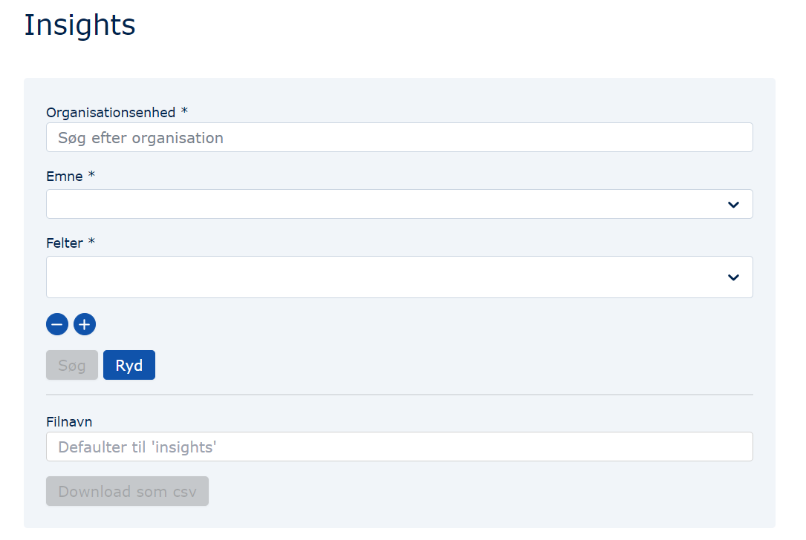
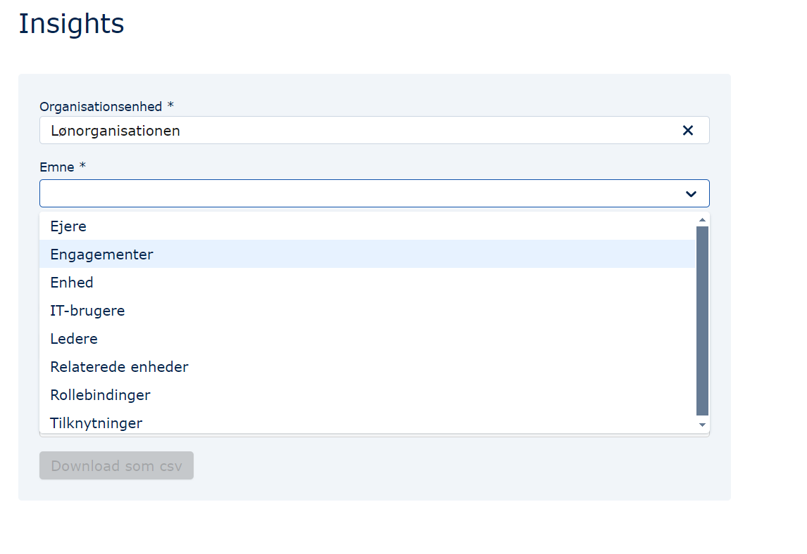

## Formål

Insights er et modul, der giver muligheden for selv at sammensætte data fra MO og udskrive dem i en csv-fil.

Formålene med modulet er mange og afhænger af, hvilke data der sammenstilles.

Et eksempel er generering af et udtræk bestående af enheder, lederfunktioner og engagementer.

Et andet er et overblik over alle enheder, deres ansatte, de ansattes adresser og telefonnumre samt stillingsbetegnelser.

## Brugergrænsefladen

Når man er inde i Insights-modulet i MO, bliver man præsenteret med dette billede:

1. Når en organisationsenhed er fremsøgt, vil de underliggende enheder også blive valgt.

2. Herefter vælges hvilke andre data, man er interesseret i. Det sker ved valg af "Emne":

3. Herefter kan der tilføjes eller fjernes data under "Felter" fra det Emne, der er valgt:

4. Hvis man ønsker, at csv-filen skal indeholde flere Emner, trykkes der på "+"-knappen:

hvorpå det bliver muligt at tilføje flere data (punkt 1-3 gentages). Ønsker man at fjerne et emne, trykkes der på "-"-knappen:

5. Herefter trykkes "Søg", hvorpå genereringen af filen igangsættes. Hvor lang tid det tager at generere filen, afhænger af, hvor mange data der er valgt. Hvis man ønsker at fjerne data fra søgningen, trykkes "Ryd":

6. Kald din fil, hvad du vil. Hvis feltet efterlades tomt, bliver den navngivet "insights":

7. Når "Download som csv"-knappen aktiveres (bliver blå), kan der trykkes på den, og csv-filen bliver hentet ned på din computer:

En eksempelfil med oplysninger om engagementer i en én enhed med en enkelt række kan se sådan ud:

