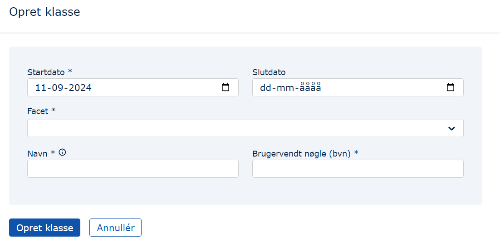
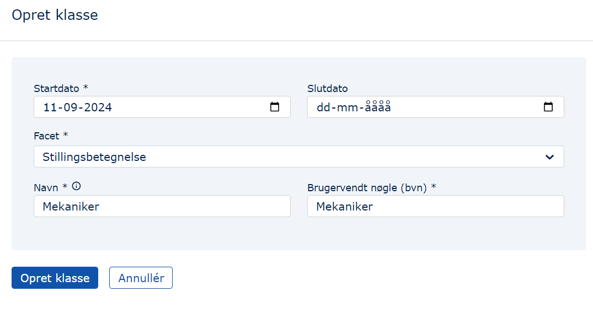
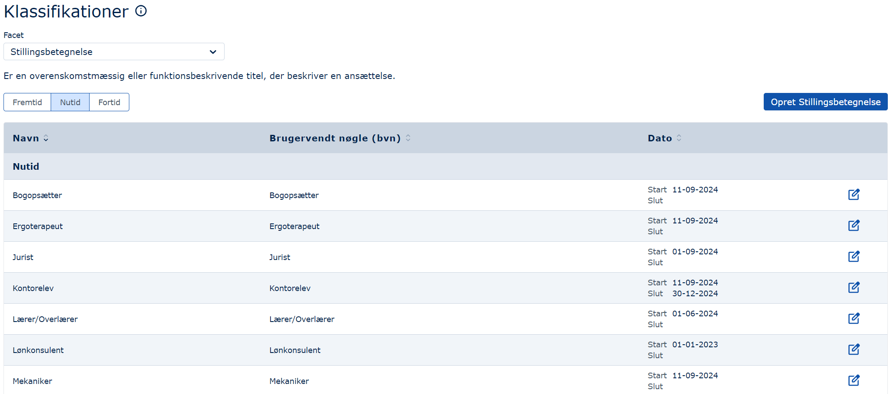

## Formål

Formålet med dette modul er at tillade brugerne selv at oprette klasser ([se og ændre eksisterende klasser](#definition)). Bemærk, at det er ikke muligt at *slette* klasser, fordi det kan have meget negative konsekvenser for allerede opmærkede data i MO (fx kan man fjerne stillingsbetegnelser fra ansatte).

## Definition

**Klasser**

Det, der normalt kaldes *metadata*, kaldes *klasser* i [OIO-standarden](https://arkitektur.digst.dk/specifikationer/organisation/oio-specifikation-af-model-organisation), og derfor benyttes denne term også her.

Et eksempel på klasser er forskellige Orlovstyper: Der findes fx Barselsorlov, Forældreorlov, Sygeorlov. Disse forskellige orlover er klasser og beskriver, hvilken type orlov der er tale om.

Et andet eksempel er Ledertyper: Man kan være fx Beredskabschef, Institutionsleder, Direktør, Områdeleder, Centerchef, Sekretariatschef. Disse forskellige ledertyper er klasser og beskriver, hvilken type leder der er tale om.

**Facetter**

En facet kan have flere klasser i sig. I ovenstående eksempler er Orlovstype og Ledertyper facetter.

**Klassifikationer**

Facetter er bundet op på en klassifikation.

Hierarkiet er altså: Klassifikation--\>Facet--\>Klasse. Læs mere om det [her](https://arkitektur.digst.dk/klassifikation).

## Brugergrænsefladen

Når man er inde i Klassifikations-modulet i MO, bliver man præsenteret for dette billede:

### Oprettelse af klasser

1. Der vælges "Opret klasse" til højre i ovenstående billede, hvorpå denne dialogboks kommer frem:

    

2. Der tages først stilling til i hvilket tidsrum, klassen skal bestå. Herefter vælges, hvilken facet

### Ændring af klasser

1. Den facet, man ønsker at ændre klasser til, vælges:

    

2. hvorefter klassen navngives. Denne navngivning skal duplikeres i feltet "Brugervendt nøgle (bvn) *", og der kan trykkes på knappen "Opret klasse":

    

3. Klassen er nu oprettet og kan findes under facetten "Stillingsbetegnelser":

    

4. Endvidere kan klassen "Mekaniker" nu selvfølgelig bruges til at angive en ny stillingsbetegnelse for en medarbejder, se her:

    

### Datostyring af klasser

Som det fremgår af ovenstående, er det muligt at datostyre sine klasser, så man fx kan oprette dem med fremtidig virkning.
