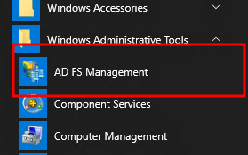
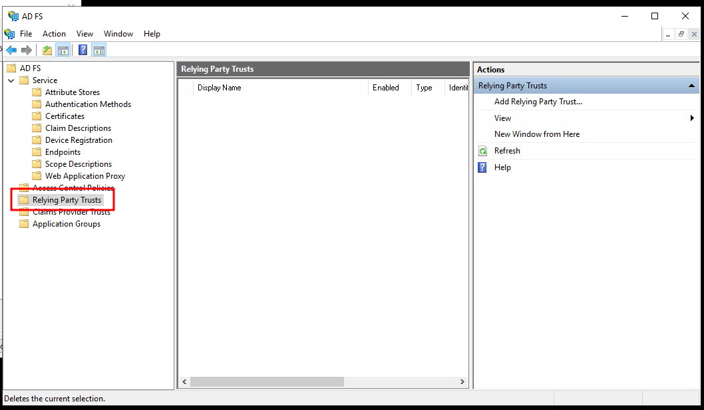
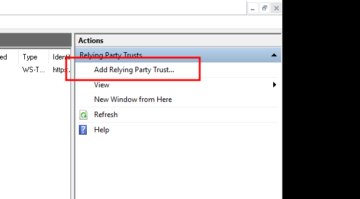
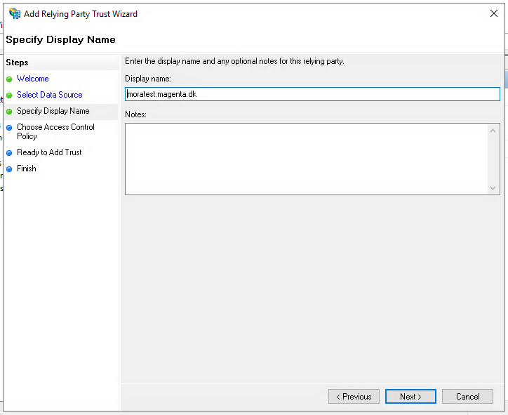
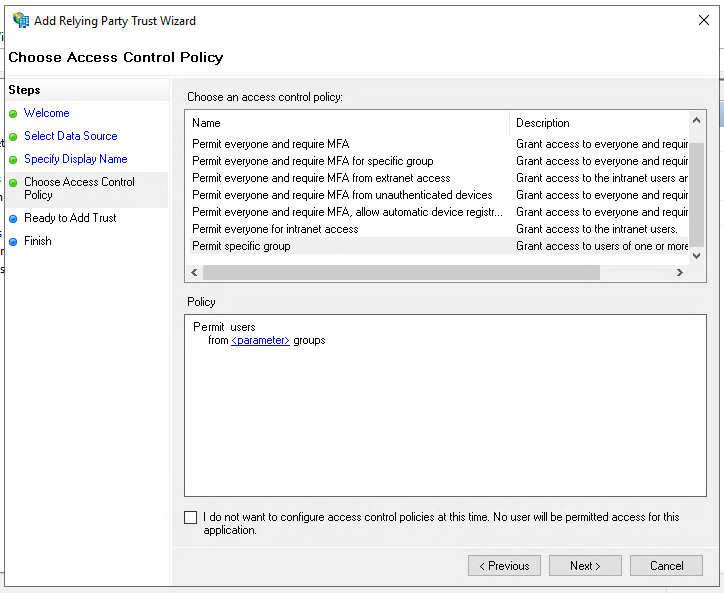
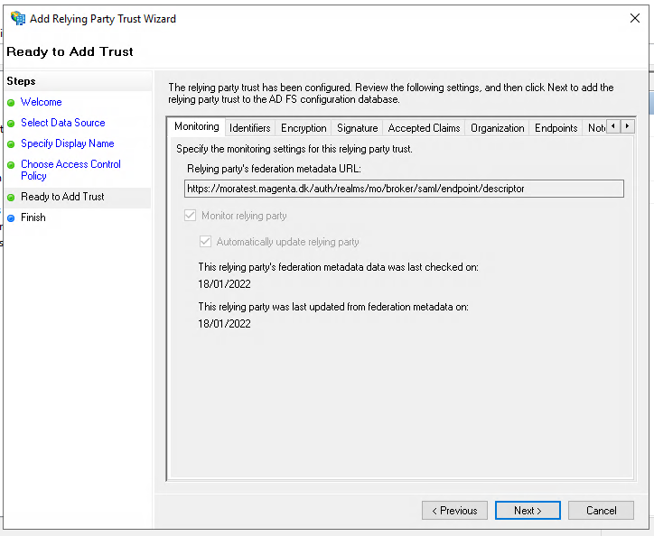
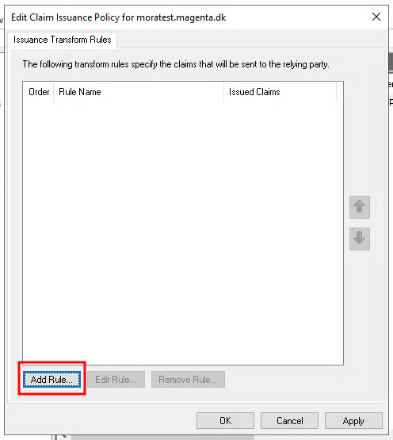
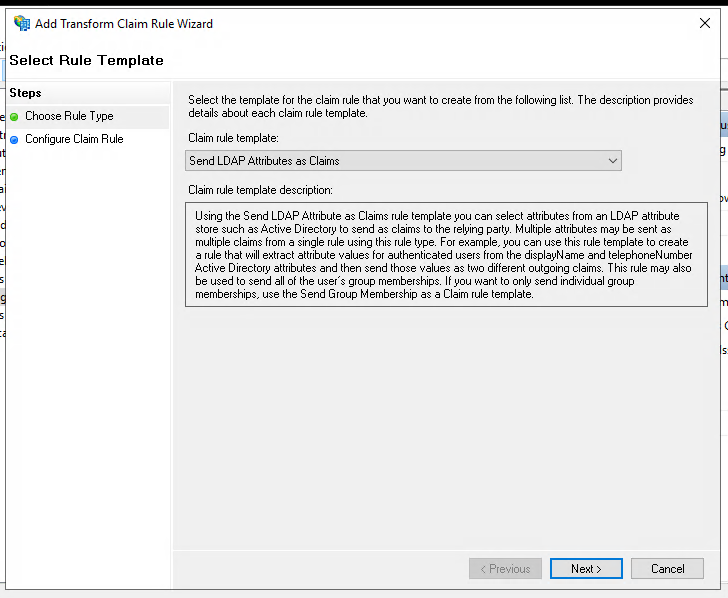
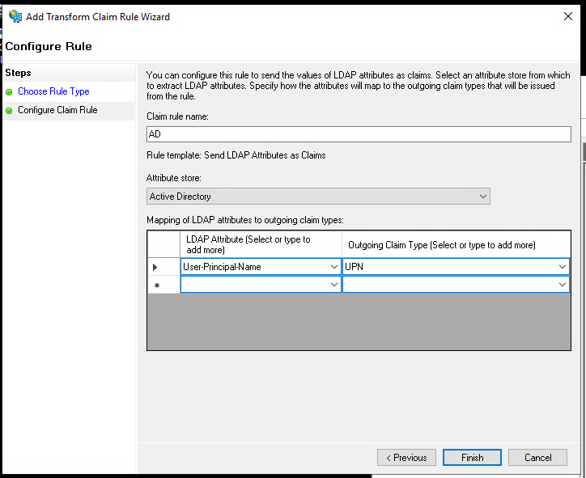
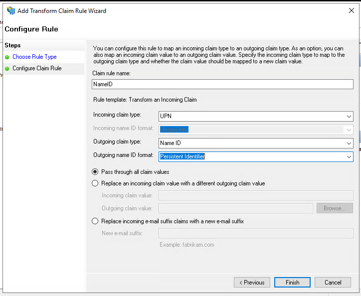

# ADFS SAML setup for OS2mo

!!! note
    This guide assumes basic knowledge of ADFS and SAML auth.

    The guide also requires OS2mo and Keycloak to have been set up on your servers.

    You will have received a set of metadata endpoints from Magenta for each of your environments.

    The metadata endpoints are usually on the form:

    ```
    https://{APPLICATION_URL}/auth/realms/mo/broker/saml/endpoint/descriptor
    ```

This guide will help you configure ADFS as an IdP for OS2mo. During the following, we will add OS2mo as a SAML Service Provider (SP) and configure the minimally required claims for accessing OS2mo.

Start by opening up the ADFS management application.



## Adding a "Relying Party Trust"

Select "Relying Party Trusts".



Click on "Add Relying Party Trust...".



This process should be performed for **each** of the environments you would like to configure.

The application must be "claims aware":

Click "Start".


Enter the metadata URL for the OS2mo deployment you would like to configure, and click "Next".

The metadata URL is usually on the form:

```
https://{APPLICATION_URL}/auth/realms/mo/broker/saml/endpoint/descriptor
```


Enter a name you would to use to identify the OS2mo configuration inside ADFS, and click "Next".



Here you will configure the access control policy for the application, i.e. define user access to OS2mo. If you are unsure of this step, it can be skipped for now by selecting the checkbox at the bottom of the dialogue.



Click "Next" again to add the OS2mo configuration.



We also need to add a claim issuance policy, so make sure to check the checkbox before hitting "Close".


## Configuring claims issuance policies

We need to add two rules:

* Sending an LDAP attribute as a claim
* Transforming that attribute to NameID

If the dialogue isn't open, select "Edit Claim Issuance Policy...".


Select "Add rule".



Select "Send LDAP Attributes as Claims" and click "Next".



Select an LDAP attribute to send as a claim. As an example we have selected "User-Principle-Name".
Select "UPN" as outgoing claim type.

Click "Finish".



Select "Add rule" again. This time select "Transform an Incoming Claim", and click "Next".


Select "UPN" as "Incoming claim type". This corresponds to the claim you created earlier.

Select "Name ID" as "Outgoing claim type" and select "Persistent Identifier" as "Outgoing name ID format".

Click "Finish".



You should now be able to log in to OS2mo using ADFS as an IdP! 🎈
