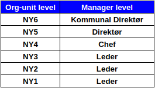

## Manager Sync in OS2mo

### Overview

Managers are updated based on data imported from SD-Løn _prior_ to running this integration, i.e.
the code does not make any calls to SD while running, but instead only updates managers
based on the data already found in MO.

The code has the following responsibilities:

1. Create any missing manager level classes in MO based on configurations provided by
   environment variables.
2. Terminate managers with no active engagement in the org unit where they are set
   as manager.
3. Assign new managers to org units based on info in special child org units
   with name ending in "_leder".

### Detailed Description

This section describes how the code logic operates when the application is triggered.

1. All current manager roles are checked to verify the employee has an active engagement in the organisation unit
   they are placed. If not: manager role get terminated (manager roles end date set to today).
2. For every organisation unit (org-unit) with `name` ending in `_leder` and name NOT prepended with `Ø_`:
   
    1. Get all employees with association to `_leder` unit.
       </p>
    2. Check each employee has an active engagement in parent org-unit. If more than
       one employee with association in `_leder` org-unit, check which employee has
       the latest `engagement from` date. The one with latest engagement date becomes
       manager in parent org-unit.
    3. The manger roles `manager_level` is based on the org-unit level in which
       the manager role is assigned:
       
    4. If the parent org-unit has `_led-adm` in its name, the manager will also become
       manager of this org-units parent org-unit (Notice: Manager level is based
       on org-unit level from the highest ranking org-unit).
       
       In the above illustration, manager fetched from `_leder` unit becomes manager
       in not only "Byudvikling" but also "Borgmesterens Afdeling" as "Byudvikling is
       marked as an `led-adm` unit. Manager level is then based on org-unit level
       from "Borgmesterens Afdeling".
    5. Once a manager has been selected based on above criteria, associations for all
       other employees in `_leder` unit are terminated. Leaving just one association
       in `_leder` unit.

## Configuration

The follow environment variables can be used to configure the application:

TODO: some of the settings can possibly be retrieved from MO automatically
instead of being set via the environment...

* `MO_URL`:  Base URL for MO
* `CLIENT_ID`:  Keycloak client ID
* `CLIENT_SECRET`: Keycloak client secret corresponding to the Keycloak client
* `ROOT_UUID`: UUID of the root organisation unit. Instance dependant.
* `MANAGER_TYPE_UUID`: Default UUID for `Manager type`. Instance dependant.
* `RESPONSIBILITY_UUID`: Default UUID for `Manager type`. Instance dependant.
* `MANAGER_LEVEL_MAPPING`: Dict with `org-unit level UUID` classes as keys and `manager level UUID` as values. Used to
  map from `org_unit_level` to `manager_level`.

## Usage

To start the container using `docker-compose`:

```
$ docker-compose up -d
```

After the container is up and running, the script can be run manually by
triggering a `FastAPI` endpoint:

* By using the GUI at:<br>
  ```http://localhost:8000/docs```
  and triggering `/trigger/all`.
* Calling the endpoint from terminal: <br>
  ```$ curl -X 'POST' 'http://localhost:8000/trigger/all'``` <br>

As it checks and updates managers you will get a lot of output in `docker logs`,
especially if you have opted for `debug` information from logs.

Once the script has finished the last lines will look like this:

```
sd_managerscript_1  | 2022-12-09 10:38.30 [info     ] Filter Managers
sd_managerscript_1  | 2022-12-09 10:38.30 [info     ] Updating Managers
sd_managerscript_1  | 2022-12-09 10:38.30 [info     ] Updating managers complete!

```

***

## Development

***

### Prerequisites

- [Poetry](https://github.com/python-poetry/poetry)

### Getting Started

1. Clone the repository:

```
git clone git@git.magenta.dk:rammearkitektur/os2mo-manager-sync.git
```

2. Install all dependencies:

```
poetry install
```

3. Set up pre-commit:

```
poetry run pre-commit install
```

### Running the tests

You use `poetry` and `pytest` to run the tests:

`poetry run pytest`

You can also run specific files

`poetry run pytest tests/<test_folder>/<test_file.py>`

and even use filtering with `-k`

`poetry run pytest -k "Manager"`

You can use the flags `-vx` where `v` prints the test & `x` makes the test stop if any tests fails (Verbose, X-fail)

### Injecting test data into OS2MO

Test data have been prepared for local development. Using the test data requires
a running OS2mo instance locally as well as the standard test data from Kolding,
which is included in OS2mo repository.

Before using this integration locally you need to clone and run the `OS2MO` container
from [OS2MO repo](https://git.magenta.dk/rammearkitektur/os2mo):
Once cloned you can start main `OS2MO` container using:
```docker-compose up --build -d```

You can now inject test data from this repository by changing folder to where this repository is located locally.
Then run the following command:

```
poetry run python tests/test_data/inject_test_data.py "603f1c82-d012-4d04-9382-dbe659c533fb"
```

UUID passed as an parameter is required password

### Development info

Sending and fetching data to/from `OS2MO` is done using a `GraphQL` client imported
from `Ra-clients` [repos here](https://git.magenta.dk/rammearkitektur/ra-clients)

***

## TODO

* Leder units have to be NY-levels - currently failing for Afdelings-niveauer
* If there is no active engagement in OU and employee currently is manager
  the manager will be terminated per todays date (and not when the engagement ended)

## Authors

Magenta ApS <https://magenta.dk>
***

## License

This project uses: [MPL-2.0](os2mo_managersync_images/LICENSES/MPL-2.0.txt)

This project uses [REUSE](https://reuse.software) for licensing.
All licenses can be found in the [LICENSES folder](os2mo_managersync_images/LICENSES) of the project.
